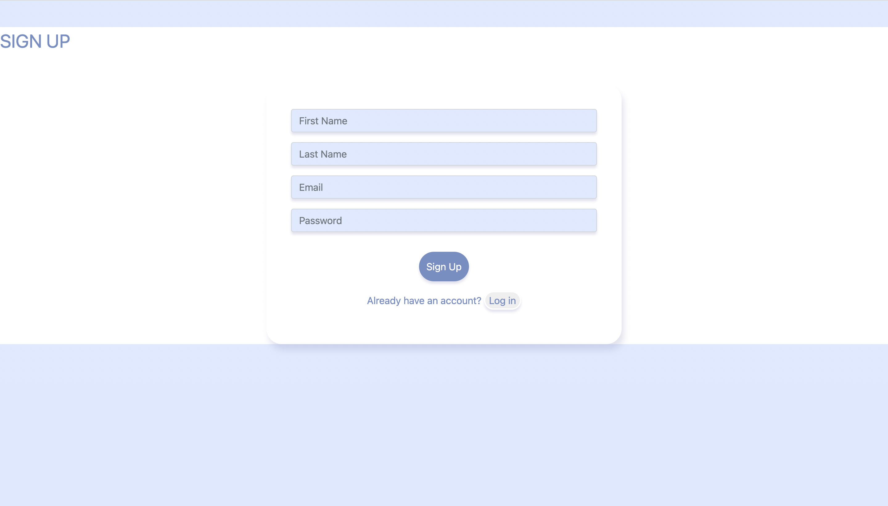
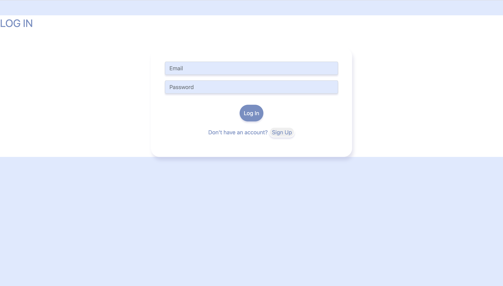
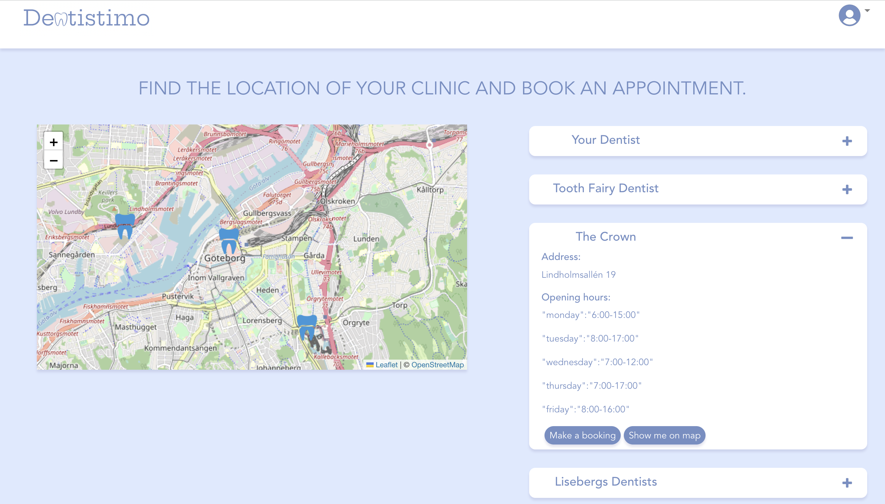
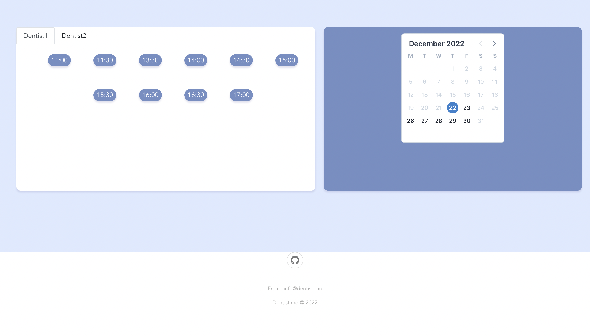
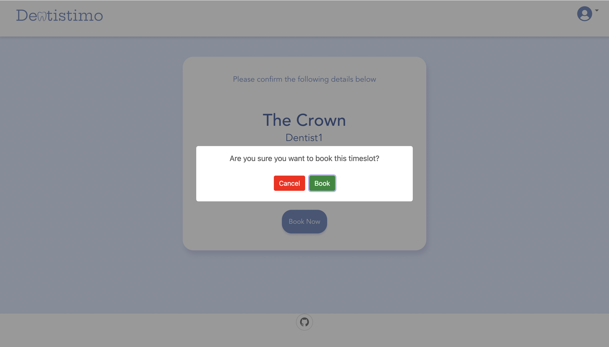

# Team 8: Dentistimo_Frontend
This project is associated with course DIT356 and has been done by group 8.

Status: The development of the project has stopped for now and there are no plans to continue it in the future.

## Description:
Dentistimo is a distributed system which allows users to book dentist appointments in the Gothenburg region and allows for more clinics to be added in the future. This repository contains Dentistimo_Frontend. The Dentistimo website provides the users with a map containing the locations of four dentistry clinics on the home page. For being able to use the functionlaities provided by the system, the users shall first login with their credentials. If the user does not have an account on the webiste, they can click on "sign up" button and create one. The home page shows the list of clinics, their opening hours and address of the clinics. The user can see the exact location of the clinic on the map by clicking on the "show on the map" button. Upon clicking on the "Make a booking" the app shows all the available timeslots of different dentists of the selected clinic and then the user can pick a time. When the user selects a timeslot, the app will show the booking page in which the bookings details can be seen. If the user clicks on the "Book" button and the selected timeslot has not been taken before, a confirmation message will pop up. After making a successful booking, the user recieves a confirmation email from Dentistimo system with the datails of their booking. The users are also able to see the list of their bookings in the bookings page. In the account page, the users can edit their acount information and save it.

Main functionalities:
- Create accounts
- Login to accounts
- A map with the clinics locations
- Zooming in and out on the map
- A list of all the clinics with their relevant details
- A show on map button to show the exact location of a clinic on map
- A calendar showing all the available dates
- A list of all the available timeslots of a selected clinic
- The possiblity to select a free timeslot in a clinic
- A booking page that that shows the details of an inprogress booking
- A book button that books the timeslot
- The possibility to cancel an ongoing booking
- A page that shows the bookings history
- The possibility of editing account information

## Visuals
- [Demo](https://git.chalmers.se/courses/dit355/dit356-2022/t-8/client-server/-/blob/main/assets/Screen_Recording_2022-12-22_at_11.07.02.mov)

## Installation guide

### Requirements:
##### 1. Install an IDE:
It is suggested to use the following IDE:

[Visual Studio Code](https://code.visualstudio.com/download)

Use the following plugins:

- [Vetur](https://marketplace.visualstudio.com/items?itemName=octref.vetur) plugin for Vue tooling

- [ESLint](https://marketplace.visualstudio.com/items?itemName=dbaeumer.vscode-eslint) plugin for linting Vue, JS, and HTML code

- [Debugger for Chrome plugin](https://marketplace.visualstudio.com/items?itemName=msjsdiag.debugger-for-chrome) for debugging
##### 2. Install Node.js:
[Node.js](https://code.visualstudio.com/download)
##### 3. Set up Backend component
- Get backend from [Backend_Repository](https://git.chalmers.se/courses/dit355/dit356-2022/t-8/data-manager) 

- Run backend accrording to the guides in [Backend_README](https://git.chalmers.se/courses/dit355/dit356-2022/t-8/data-manager/-/blob/main/README.md)
##### 4. Set up middleware component

- Get middleware from [Middleware_Repository](https://git.chalmers.se/courses/dit355/dit356-2022/t-8/t8-project)

- Follow the guidlines in the [Middleware_README](https://git.chalmers.se/courses/dit355/dit356-2022/t-8/t8-project/-/blob/main/README.md) to run the middleware.

##### 5. Set up security component

- Get security component from [Security](https://git.chalmers.se/courses/dit355/dit356-2022/t-8/user-manager)

- Follow the guidlines in the [Security_README](https://git.chalmers.se/courses/dit355/dit356-2022/t-8/user-manager/-/blob/main/README.md) to run the security component.
##### 6. Install a browser:

- You can use [Google Chrome](https://www.google.com/chrome/)
- Use [Vue.js devtools plugin](https://chrome.google.com/webstore/detail/vuejs-devtools/nhdogjmejiglipccpnnnanhbledajbpd?hl=en) for debugging.

## Usage
The Dentistimo_Frontend bascially provides User Interaces that the makes it possbile for the users to interact with the system and book appointments in one of the dentistry clinics in Gothenburg.
### Usage example 1:
You are a new user of the app. You can not see all the functionalities of the system in the home page. You have to log in. You do not have an account, so you should first sign up.
Then you log in to your account and can see the clinics.

### Usage example 2:
You are a user that has already loged in to your account. You want to book an appointment in "The Crown" clinic. You first select the clinic. Then choose a date in the calendar and pick one dentist. Then you go to the booking page. click on the "Book" button and confirm the booking to be made.

## Support
If you encountred any issue related to the Dentistimo_Frontend, it is suggested to first check the other components (backend, security and middleware) and see if they are running properly.
If you could not fix the issue, you can always contact us on [this email](dentistimo.dit356@gmail.com).

## Contributing
We are at this moment, not open to contributions.

## Authors and acknowledgment
- [Yasamin Fazelidehkordi](https://git.chalmers.se/yasaminf)
- [Amin Mahmoudifard](https://git.chalmers.se/aminmah)
- [Emrik Dunvald](https://git.chalmers.se/dunvald)
- [Daniel J Coetzer](https://git.chalmers.se/coetzer)
- [Julia Ayvazian](https://git.chalmers.se/ayvazian)
- [Patrik Samcenko](https://git.chalmers.se/samcenko)
- [Vladyslav Shatskyi](url)

## License

